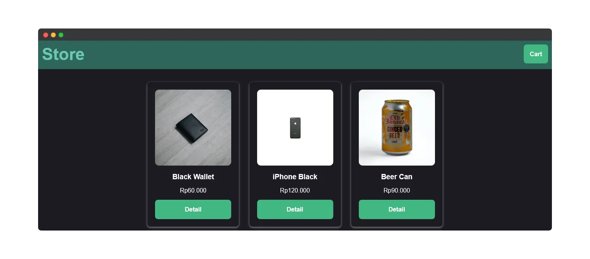

# quickcart-client

[](https://www.linkedin.com/in/rakha-djauhari/) [](https://github.com/Zevhys/quickCart-client/blob/main/LICENSE)  [](https://github.com/Zevhys/quickCart-client/actions/workflows/codeql.yml) [](https://github.com/Zevhys/quickCart-client/actions/workflows/stylelint.yml) [](https://github.com/Zevhys/quickCart-client/actions/workflows/eslint.yml) 

<div align="center">
 
</div>

</br>

Quick Cart is a simple tool that lets you easily turn any product display into a shopping cart. Seamless shopping, right out of the box. Quick Cart is a Vue.js component that makes adding a shopping cart to your app a breeze. Its intuitive interface and flexible customization options.

> [!NOTE]  
> <b>visit the Quick Cart Server repository, [Here](https://github.com/Zevhys/quickCart-server)</b>

# Tech Stack


# Requirements

```bash
# Clone Repository
git clone https://github.com/Zevhys/quickCart-client .

# Install Dependencies
npm install

# Run The Application
- npm run serve (hot-reloads development)
- npm run build (minifies production)

# Running ESLint & Style
- npx eslint .
- npx stylelint "**/*.{css,vue, html}"
```
